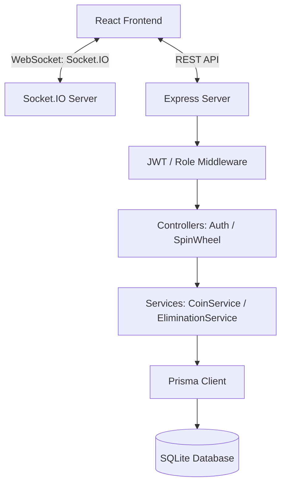

# 🎡 RoxStar Spin Wheel Game System

A real-time multiplayer spin wheel game system with full-featured React frontend, Node.js + Express backend, SQLite database using Prisma ORM, and Socket.IO for real-time multiplayer updates.

---

## 🚀 Quick Start Instructions

To run both the server and client concurrently:

### Prerequisites
- Node.js (v18 or higher recommended)
- npm

### 1. Set Up the Server
Open a terminal and navigate to the `server` directory:
```bash
cd server
npm install
npx prisma migrate dev --name init
npm run dev
```
The server will start on port `3001` with SQLite database initialized and pre-seeded.

### 2. Set Up the Client
Open another terminal and navigate to the `client` directory:
```bash
cd client
npm install
npm run dev
```
The React application will start on `http://localhost:5173`.

---

## 📋 Test Credentials
The database is pre-seeded with the following credentials:
- **Admin**: `admin@roxstar.com` / `admin123`
- **Users**: 
  - `alice@test.com` / `user123`
  - `bob@test.com` / `user123`
  - `charlie@test.com` / `user123`
  - `diana@test.com` / `user123`

---

## 🏗️ High-Level System Architecture



### Key Technical Decisions:
1. **SQLite Database with Transactions**: SQLite supports transaction isolation. To satisfy the prompt's requirement for **atomic coin operations** and prevent race conditions/double-spend on coins, we use Prisma's `$transaction` with interactive querying.
2. **Socket.IO Rooms**: Each spin wheel game runs inside its own isolated Socket.IO room `wheel:<id>`. Clients join the room upon entering the game arena, allowing targeted event broadcasting for joins, countdown ticks, eliminations, and winner announcements.
3. **In-Memory Countdown & Elimination Loop**: When an admin creates or manually starts a game, Node.js timers handle the countdown ticks (1-second intervals) and the game state eliminations (7-second intervals), persisting each elimination event to the database and broadcasting it in real-time.

---

## 🛠️ Requirements & Edge Cases Handled

### 1. Spin Wheel Lifecycle (40 Points)
- **Only admins can create a spin wheel**: Protected via `/api/spin-wheel` POST route checking user roles (role must be `ADMIN`).
- **Only ONE active spin wheel at a time**: Before creating a spin wheel, the database is queried for any spin wheel with status `WAITING` or `ACTIVE`. If found, the request is rejected.
- **Users pay entry fee in coins to join**: Atomic balance check and coin subtraction.
- **Auto-start after 3 minutes OR manual start by admin**: Implemented timer-based scheduling. If a wheel is waiting and 3 minutes expire, it automatically starts if there are 3+ players, otherwise it automatically aborts. Admin can manually start early if min players are met.
- **Auto-abort and refund**: If `< 3` participants join by the 3-minute mark, the server changes the status to `ABORTED` and refunds entry fees to all players, recording refund transactions.
- **Generate random elimination sequence**: Using the Fisher-Yates shuffle algorithm.
- **Eliminate one user every 7 seconds**: Non-blocking asynchronous interval loop. Each tick updates the user status in the database and broadcasts the elimination message.
- **Last remaining user wins**: Triggers payouts and completes the game status.

### 2. Coin Distribution System (30 Points)
- **Database-Driven Configurations**: All pool shares and configurations (Winner pool, Admin pool, App pool, Entry fee, timer durations) are database-driven and retrieved from the `game_config` table.
- **Split Distribution**:
  - **Winner Pool**: `X%` (Default `70%`)
  - **Admin Pool**: `Y%` (Default `20%`)
  - **App Pool**: `Z%` (Default `10%`)
- **Atomic Operations**: Using database transactions (`prisma.$transaction`) to guarantee that partial credits/debits never occur.
- **Concurrency Safety**: Implemented via locks on the `User` record to ensure multiple concurrent joins do not result in double-deductions or race conditions.

### 3. Real-Time Communication (30 Points)
- **Real-time broadcasts**: Events are emitted for creation, user join, countdown timer updates, game start, eliminations, winner announcements, and aborts.
- **Room isolation**: Users subscribe only to their specific active room, keeping network traffic clean.

---

## 📂 Project Structure

```
roxstar/
├── server/
│   ├── prisma/
│   │   ├── schema.prisma      # DB Schema definition
│   │   └── seed.js            # Admin / config pre-seeder
│   └── src/
│       ├── config/
│       │   └── database.js    # Prisma client singleton
│       ├── controllers/       # HTTP requests handlers
│       ├── middleware/        # Authentication & Role guards
│       ├── routes/            # REST API endpoints mapping
│       ├── services/          # Coin logic & elimination loops
│       ├── socket/            # Socket.IO handlers
│       └── server.js          # Main entrypoint
└── client/
    └── src/
        ├── context/           # React Auth state
        ├── pages/             # Auth, Dashboard & Game pages
        └── services/          # REST & WebSocket client layers
```
